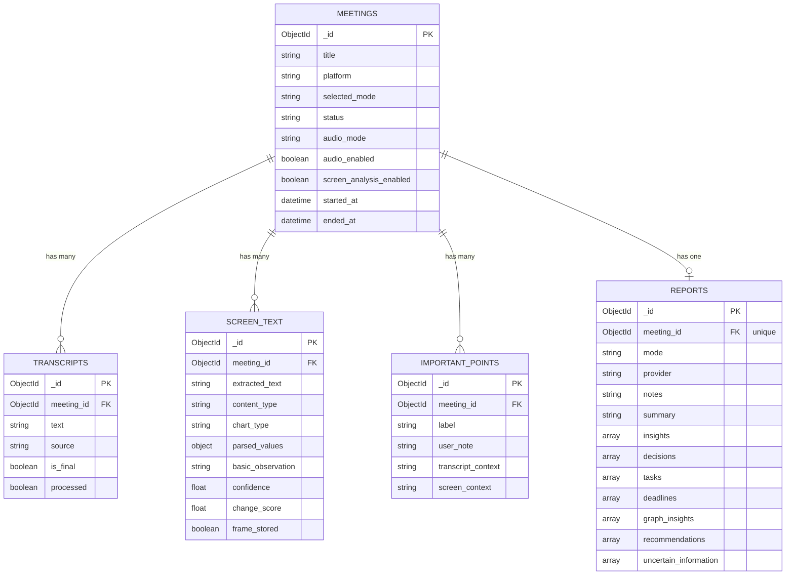

# VoxVision AI — Entity-Relationship Diagram

## Overview

VoxVision AI uses **MongoDB** as its primary database. The data model consists of five core collections, all centered around the `meetings` collection. Each meeting can have multiple transcripts, screen text entries, important points, and one generated report.

---

## Entity Descriptions

### Meetings

The central entity representing a meeting session. All other entities reference a meeting by its `_id`.

| Field | Type | Required | Description |
|---|---|---|---|
| `_id` | `ObjectId` | Auto | Unique meeting identifier (MongoDB-generated) |
| `title` | `string` | Yes | User-provided meeting title |
| `platform` | `string` | No | Meeting platform (e.g., `"google_meet"`) |
| `selected_mode` | `string` | Yes | Report generation mode (e.g., `"detailed"`, `"concise"`) |
| `status` | `string` | Yes | Current meeting state: `"active"`, `"paused"`, `"stopped"` |
| `audio_mode` | `string` | No | Audio capture mode (e.g., `"webspeech"`) |
| `audio_enabled` | `boolean` | No | Whether microphone capture is active |
| `screen_analysis_enabled` | `boolean` | No | Whether screen OCR capture is active |
| `started_at` | `datetime` | Auto | Timestamp when the meeting was created |
| `ended_at` | `datetime` | No | Timestamp when the meeting was stopped (null while active) |

---

### Transcripts

Individual speech-to-text segments captured during a meeting. Multiple transcripts belong to a single meeting.

| Field | Type | Required | Description |
|---|---|---|---|
| `_id` | `ObjectId` | Auto | Unique transcript identifier |
| `meeting_id` | `ObjectId` | Yes | Reference to the parent meeting |
| `text` | `string` | Yes | Transcribed speech content |
| `source` | `string` | No | Source of the transcript (e.g., `"webspeech"`, `"manual"`) |
| `is_final` | `boolean` | No | Whether this is a finalized (non-interim) transcript segment |
| `processed` | `boolean` | No | Whether this transcript has been included in report generation |

---

### Screen Text

OCR-extracted text and metadata from screen captures taken during a meeting. Each entry represents one analyzed screenshot.

| Field | Type | Required | Description |
|---|---|---|---|
| `_id` | `ObjectId` | Auto | Unique screen text identifier |
| `meeting_id` | `ObjectId` | Yes | Reference to the parent meeting |
| `extracted_text` | `string` | Yes | Raw text extracted via Tesseract OCR |
| `content_type` | `string` | No | Detected content type: `"text"`, `"chart"`, `"table"`, `"diagram"` |
| `chart_type` | `string` | No | Chart sub-type if applicable: `"bar"`, `"line"`, `"pie"`, etc. |
| `parsed_values` | `object` | No | Structured key-value data extracted from charts/tables |
| `basic_observation` | `string` | No | Human-readable description of the screen content |
| `confidence` | `float` | No | OCR confidence score (0.0–1.0) |
| `change_score` | `float` | No | How much the screen changed since the previous capture (0.0–1.0) |
| `frame_stored` | `boolean` | No | Whether the original image frame was stored on disk |

---

### Important Points

User-marked moments of significance during a meeting. Each important point captures contextual data from the transcript and screen at the time it was marked.

| Field | Type | Required | Description |
|---|---|---|---|
| `_id` | `ObjectId` | Auto | Unique important point identifier |
| `meeting_id` | `ObjectId` | Yes | Reference to the parent meeting |
| `label` | `string` | Yes | Short label (e.g., `"Key Decision"`, `"Action Item"`) |
| `user_note` | `string` | No | Free-form note from the user |
| `transcript_context` | `string` | No | Snapshot of the transcript at the time of marking |
| `screen_context` | `string` | No | Snapshot of the screen content at the time of marking |

---

### Reports

AI-generated meeting report. Each meeting has at most one report, which can be edited after generation.

| Field | Type | Required | Description |
|---|---|---|---|
| `_id` | `ObjectId` | Auto | Unique report identifier |
| `meeting_id` | `ObjectId` | Yes | Reference to the parent meeting (unique — one report per meeting) |
| `mode` | `string` | Yes | Report mode used for generation (e.g., `"detailed"`) |
| `provider` | `string` | Yes | AI provider used: `"gemini"`, `"openai"`, `"openrouter"`, `"demo"` |
| `notes` | `string` | No | Comprehensive meeting notes |
| `summary` | `string` | No | High-level meeting summary |
| `insights` | `array<string>` | No | Key insights extracted from the meeting |
| `decisions` | `array<string>` | No | Decisions made during the meeting |
| `tasks` | `array<string>` | No | Action items and tasks identified |
| `deadlines` | `array<string>` | No | Deadlines and time-sensitive items |
| `graph_insights` | `array<string>` | No | Observations about charts and graphs shown on screen |
| `recommendations` | `array<string>` | No | AI-generated recommendations based on the meeting |
| `uncertain_information` | `array<string>` | No | Information the AI flagged as unclear or unverified |

---

## Relationships

| Relationship | Type | Description |
|---|---|---|
| Meeting → Transcripts | One-to-Many | A meeting has zero or more transcript entries. Each transcript belongs to exactly one meeting via `meeting_id`. |
| Meeting → Screen Text | One-to-Many | A meeting has zero or more screen text entries. Each screen text entry belongs to exactly one meeting via `meeting_id`. |
| Meeting → Important Points | One-to-Many | A meeting has zero or more important points. Each important point belongs to exactly one meeting via `meeting_id`. |
| Meeting → Report | One-to-One | A meeting has at most one generated report. The report references its meeting via `meeting_id` (unique constraint). |

When a meeting is deleted, **all** associated transcripts, screen text entries, important points, and the report are cascade-deleted.

---

## ER Diagram

---

## Indexes

For optimal query performance, the following indexes are recommended:

| Collection | Index | Type | Purpose |
|---|---|---|---|
| `transcripts` | `{ meeting_id: 1 }` | Regular | Fast lookup of transcripts by meeting |
| `screen_text` | `{ meeting_id: 1 }` | Regular | Fast lookup of screen text by meeting |
| `important_points` | `{ meeting_id: 1 }` | Regular | Fast lookup of important points by meeting |
| `reports` | `{ meeting_id: 1 }` | Unique | Enforce one report per meeting + fast lookup |
| `meetings` | `{ status: 1 }` | Regular | Filter meetings by status |
| `meetings` | `{ started_at: -1 }` | Regular | Sort meetings by most recent |
