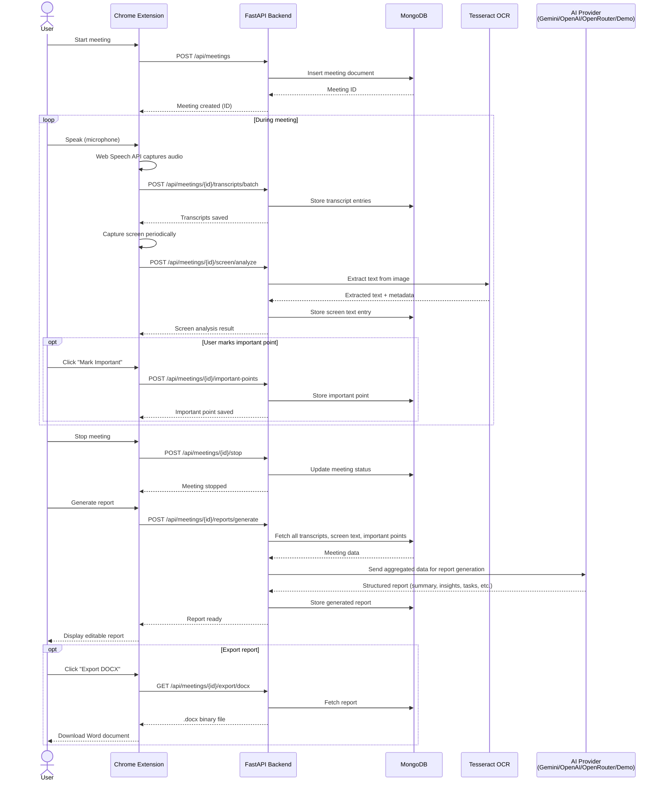
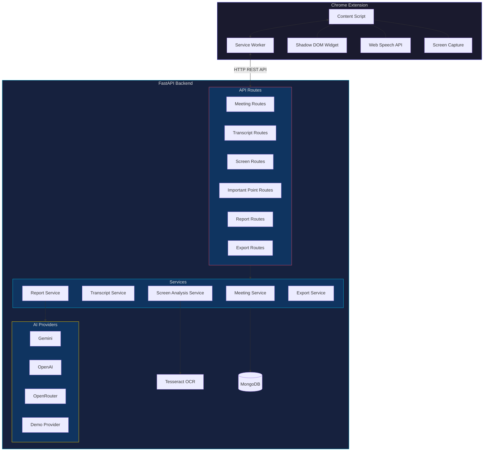

# VoxVision AI — System Architecture

## Overview

VoxVision AI is a real-time meeting assistant built as a **Chrome Extension** paired with a **FastAPI backend**. During a Google Meet session, the extension captures microphone speech using the Web Speech API, periodically screenshots the shared screen for OCR text extraction, and lets users mark important moments—all streamed to the backend. When the meeting ends, the backend aggregates all captured data and sends it to an AI provider (Gemini, OpenAI, OpenRouter, or a built-in Demo provider) to generate a structured, editable meeting report. The final report can be exported as a `.docx` Word document.

The architecture follows a clear separation of concerns:
- **Chrome Extension** — Handles all client-side UI, speech capture, screen capture, and user interactions within the Google Meet page.
- **FastAPI Backend** — Provides the REST API, manages data persistence in MongoDB, performs OCR via Tesseract, and orchestrates AI report generation.

---

## Meeting Flow — Sequence Diagram

The following diagram shows the end-to-end flow of a meeting session, from creation to report export:

---

## Component Architecture

The following diagram shows the internal component structure of both the Chrome Extension and the FastAPI Backend:

---

## Technology Stack

### Chrome Extension (Frontend)

| Technology | Purpose |
|---|---|
| **JavaScript (ES6+)** | Core extension logic |
| **Chrome Extensions Manifest V3** | Extension architecture and permissions |
| **Web Speech API** | Real-time browser-based speech-to-text |
| **Shadow DOM** | Encapsulated UI widget injected into Google Meet |
| **Content Scripts** | Interact with the Google Meet page DOM |
| **Service Worker** | Background processing, API communication, lifecycle management |
| **Canvas API** | Screen capture and image processing |

### Backend

| Technology | Purpose |
|---|---|
| **Python 3.10+** | Backend language |
| **FastAPI** | Async REST API framework |
| **Uvicorn** | ASGI server |
| **Motor** | Async MongoDB driver for Python |
| **MongoDB** | NoSQL document database for all persistent data |
| **Tesseract OCR (pytesseract)** | Optical Character Recognition for screen captures |
| **Pillow (PIL)** | Image processing and manipulation |
| **python-docx** | Word document (.docx) generation for report export |
| **Google Generative AI SDK** | Gemini AI provider integration |
| **OpenAI SDK** | OpenAI and OpenRouter provider integration |
| **Pydantic** | Request/response validation and serialization |

### Infrastructure & Tooling

| Technology | Purpose |
|---|---|
| **CORS Middleware** | Cross-origin request handling for extension ↔ backend communication |
| **python-dotenv** | Environment variable management |
| **Git** | Version control |

---

## Data Flow

### 1. Meeting Initialization

When the user starts a meeting from the extension widget, the content script communicates with the service worker, which sends a `POST /api/meetings` request to the backend. The backend creates a meeting document in MongoDB and returns the meeting ID. All subsequent data (transcripts, screen captures, important points) is linked to this meeting ID.

### 2. Real-Time Data Capture

During an active meeting, two parallel data streams flow from the extension to the backend:

- **Speech transcription:** The Web Speech API continuously captures microphone audio, converts it to text, and the extension batches these transcript segments before sending them to the backend via `POST /api/meetings/{id}/transcripts/batch`.
- **Screen analysis:** The extension periodically captures the visible screen content, calculates a change score to avoid redundant captures, and uploads changed frames to `POST /api/meetings/{id}/screen/analyze`. The backend runs Tesseract OCR to extract text, identifies content types (plain text, charts, tables), and stores structured observations.

### 3. User Annotations

At any point during the meeting, the user can click a "Mark Important" button in the widget. The extension captures the current transcript context and screen context and sends them along with the user's label and optional note to `POST /api/meetings/{id}/important-points`.

### 4. Report Generation

After the meeting is stopped, the user triggers report generation. The backend:
1. Fetches all transcripts, screen text entries, and important points for the meeting.
2. Constructs a comprehensive prompt with all the meeting data.
3. Sends the prompt to the configured AI provider.
4. Parses the AI response into structured fields: summary, insights, decisions, tasks, deadlines, graph insights, recommendations, and uncertain information.
5. Stores the generated report in MongoDB.

The user can then view and edit the report directly in the extension UI.

### 5. Export

The user can export the final report as a `.docx` Word document via `GET /api/meetings/{id}/export/docx`. The backend uses `python-docx` to generate a professionally formatted document with sections for each report field and serves it as a downloadable binary file.
